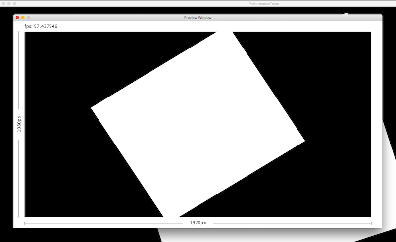

# Large Sketch Viewer
*Large Sketch Viewer* is a [Processing](https://processing.org/) library that displays a small preview window of your Sketch, allowing you to see Sketches that are too large to view on your current screen.

I created this library because I was developing a Sketch targeted at an HD television screen with a resolution of 1920x1080. I wanted to be able to run, test and modify my sketch when I only had access to my laptop which has a resolution of 1440x900. This Sketch allows you to create a pixel perfect Sketch at your final target resolution 1920x1080 while working on a smaller screen. This library does not change your Sketch size or mess with the width and height variables. When you are ready to run your Sketch on your final large screen the only thing you need to do is delete the line that initializes this library.

## Usage
Download and install this library. See [How to Install a Contributed Library](https://github.com/processing/processing/wiki/How-to-Install-a-Contributed-Library).

In your Sketch, import the library and initialize it in setup. Below is a complete minimal sketch:

    import largesketchviewer.*;
    void setup() {
        size(1920, 1080);
        LargeSketchViewer.smallPreview(this);
    }    
    void draw() {
        // your drawing code goes here as usual
    }

For more examples see the examples folder.

## Related: Most Pixels Ever
This library serves a different purpose than Daniel Shiffman's [Most Pixels Ever](https://github.com/shiffman/Most-Pixels-Ever-Processing) library. Most Pixels Ever is used to span and keep synchronized multiple Processing sketches across large and/or multiple physical screens. Large Sketch Viewer does not do this; this library is only useful for developing for single large screen that is larger than the screen on your development computer.   

## Developer
 * Import the project into Eclipse.
 * Update sketchbook.location in build.properties to point to your Processing Sketchbook
 * From the menu bar, choose Window → Show View → Ant. A tab with the title "Ant" will pop up on the right side of your Eclipse editor.
 * Drag the resources/build.xml file in there, and a new item "ProcessingLibs" will appear.
 * Press the "Play" button inside the "Ant" tab.
 * Your built library will be automatically copied to your Sketchbook folder

See [Processing Library Template for Eclipse](https://github.com/processing/processing-library-template) for more detailed instructions.

## TODO
 * Manually set viewer window resolution
 * Improve performance

## References
 * <https://github.com/processing/processing-library-template>
 * <https://github.com/processing/processing/wiki/Library-Basics>